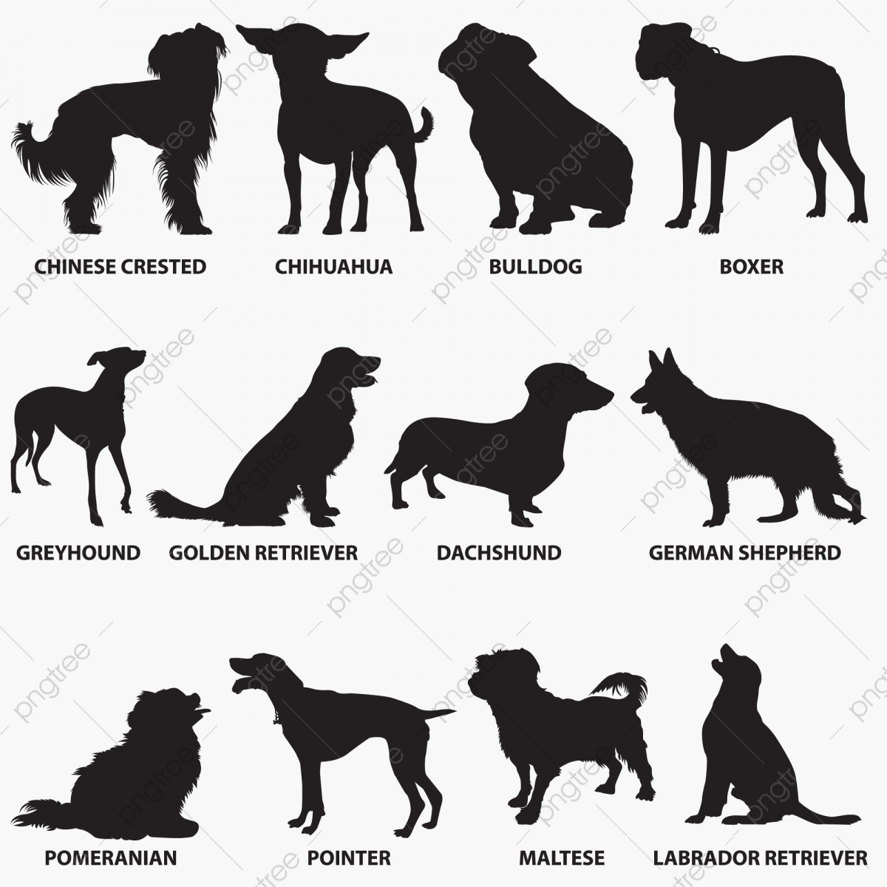

# [Dog Breed Classifier](https://github.com/ifeelfree/dog_breed_classifier) 


## Table of Contents
  * [Project Overview](#project-overview)
    + [Human Detection](#human-detection)
    + [Dog Detection](#dog-detection)
    + [Dog Breed Classifier](#dog-breed-classifier)
  * [Project Installation](#project-installation)
    + [Code and data](#code-and-data)
    + [Development environment setup](#development-environment-setup)
      - [(Optional) Docker](#-optional--docker)
      - [(Optional) Linux](#-optional--linux)
      - [(Optionl) Other platforms](#-optionl--other-platforms)
    + [Jupter Notebook](#jupter-notebook)
  * [Licence](#licence)

 


## Project Overview

The purpose of this project is to use Deep Neural Network to classify the dog breed if the given picture happens to be a dog. In order to make the project funny, if the given picture comes from a person, we also want to know what kind of dogs this person look like. 

A full and detailed report of this project can be found in Medium blog [Dog Breed Classier](https://majianglin2003.medium.com/dog-breed-classier-26977185f5e0)

The whole structure of the project is given by Udacity instructors, so please check [LICENCE.txt](LICENCE.txt) if you want to re-use some codes in this project. 

The project is composed of three important components: human detection, dog detection and dog breed classifier. 

### Human Detection 

Human detection is done by face detection function provided by OpenCV. If we can detect a person's face, then we think that a person appears in the image.  

Face detection in OpenCV uses a traditional machine learning algorithm: Haar Cascades, and see [Face Detection using Haar Cascades](https://opencv-python-tutroals.readthedocs.io/en/latest/py_tutorials/py_objdetect/py_face_detection/py_face_detection.html) for more details about this method.  


### Dog Detection 

Dog detection is done with ResNet50, which has been trained with imagenet. If dogs appear in the image, ResNet50 will give us a positive feedback. 


### Dog Breed Classifier 

We have tried three different architectures to train the dog breed classifier:
- Self-defined Neural Network: a self-defined shallow Neural Network that shares some similarities with VGG16. We train the Neural Network from scratch. With this network, we obtain a classification accuracy of 7.5359%. 
- VGG16 Neural Network: we fine-tune the VGG16 Neural Network, and get a classification accuracy of 69.4976%. 
- Inception3 Neural Network: we fine-tune the Inception3 Neural Network, and get a classification accuracy of 79.6651%. 
 
## Project Installation 

### Code and data
1. clone the repository https://github.com/ifeelfree/dog_breed_classifier
2. download [human dataset](https://s3-us-west-1.amazonaws.com/udacity-aind/dog-project/lfw.zip) and put it in `git_project_dir/data/`
3. download [dog dataset](https://s3-us-west-1.amazonaws.com/udacity-aind/dog-project/dogImages.zip), and put it in `git_project_dir/data/`
4. download [VGG-16 bottleneck features](https://s3-us-west-1.amazonaws.com/udacity-aind/dog-project/DogVGG16Data.npz), and put it in `git_project_dir/bottleneck_features`
5. download [Inception 3 bottleneck features](https://s3-us-west-1.amazonaws.com/udacity-aind/dog-project/DogVGG16Data.npz), and put it in `git_project_dir/bottleneck_features`
6. download [haarcascades](https://github.com/opencv/opencv/blob/master/data/haarcascades/haarcascade_frontalface_alt.xml), and put it in `git_project_dir/haarcascades`

### Development environment setup
#### (Optional) Docker
 
I use Docker to host the development environment for `dog_app.ipynb` Jupyter Notebook. The docker image comes from `tensorflow/tensorflow:latest-gpu-jupyter`, and the host machine is Ubuntu 18.04. 

Suppose the project is located at /home/myname/dog_breed_classifier in my local machine, and then I use 

```
sudo docker run -it -v /home/myname/dog_breed_classifier:/tf/notebook --gpus all -p 8888:8888 tensorflow/tensorflow:latest-gpu-jupyter
```

to set up the Jupyter Notebook server in Docker container. 

After that, in my local machine, I type `http://localhost:8888` in my explorer to access the Jupyter Notebook file `dog_app.ipynb`, and do experiments there. I install necessary libraries as the experiment goes, which can be found in the notebook. 

 

#### (Optional) Linux
This is the suggested by Udacity course [dog-project](https://github.com/udacity/dog-project), and I just copy the procedure:
- to install with GPU support, change requirements/dog-linux.yml to requirements/dog-linux-gpu.yml
- `conda env create -f requirements/dog-linux.yml`
- source activate dog-project


#### (Optionl) Other platforms
For Windows, Mac, AWS and so on, please check the Udacity course instruction from [dog-project](https://github.com/udacity/dog-project). 
 
 
### Jupter Notebook

When the codes, data and development platform are ready, it is time to launch Jupyter Notebook:

```jupyter notebook dog_app.ipynb```

If you use Jupter Notebook GPU Docker for tensorflow, when you launch the container, the Jupyter Notebook will run automatically. 

## Licence

Licence from Udacity [LICENCE.txt](LICENCE.txt). 